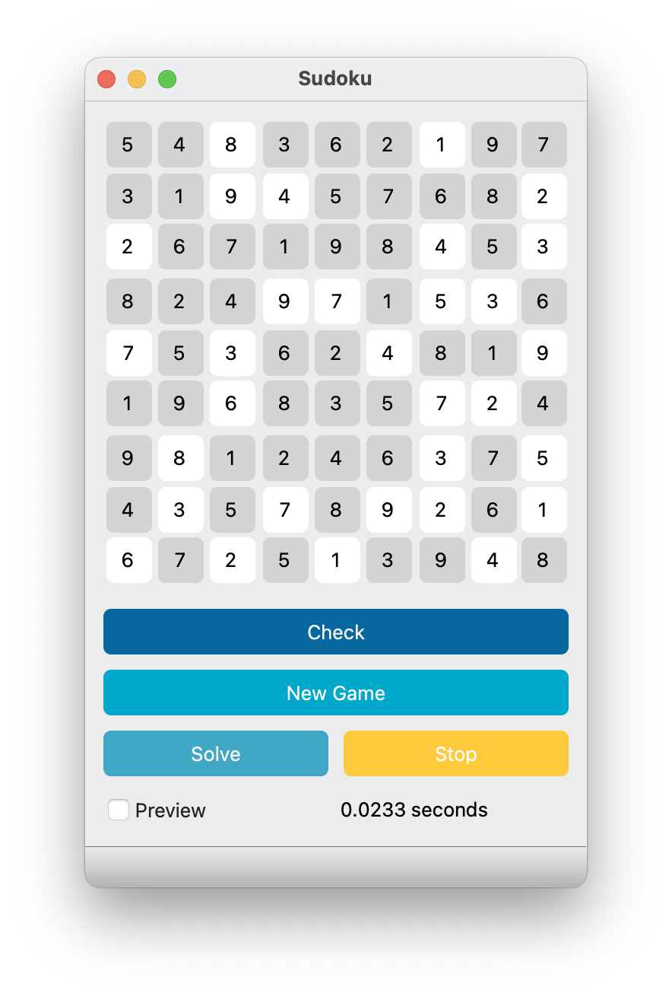

# Sudoku-AI

Sudoku Solver using Constraint Satisfaction Problem **(CSP)** solutions and BackTracking.

---

## Python
The python version of this program uses the [pyside6](https://wiki.qt.io/Qt_for_Python) library to design the user interface.



|   | Process time |
| - | ------------ |
| Normal Sudoku | 0.002s |
| Hardest Sudoku | 19.7s |

### Usage
First install requirements packages:
```
pip install -r requirements.txt
```

Then you can run the program:
```
python main.py
```

## C++


---

## ToDo
- [x] C++
- [x] Python
- [x] C#
- [ ] javaScript